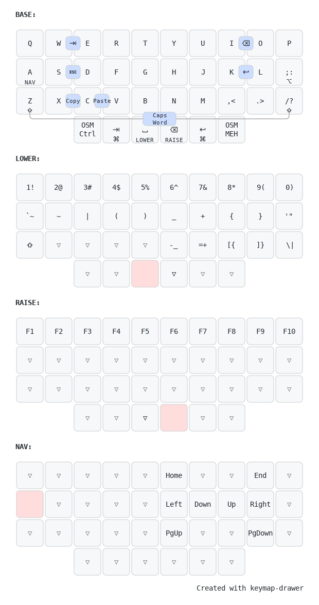

# Franky36

Franky36 is 36 key compact handwired split keyboard.
It uses RP2040-Zero controller and QMK firmware.

GMK 9009 clone PBT keycaps are used in the photo.

## Features

- Split with single controller
- QMK (fully customizable)
- VIA support
- OLED display with layer status
- USB-C

## Layout

The default layout is similar to the Planck layout.

## Bill Of Material

| Item                              | Quantity |
|-----------------------------------|----------|
| 3D printed case parts             | 6        |
| RP2040-Zero controller            | 1        |
| MX switches                       | 36       |
| Through hole 1N4148 diodes        | 36       |
| OLED 128x32 SSD1306 display       | 1        |
| 1u keycaps                        | 32       |
| 1.25u keycaps                     | 4        |
| Electrical wires                  |          |
| Magnetic USB-C adapter (optional) | 1        |
| Foam                              | 1        |

## Case and Plate

Designed in OpenSCAD and 3D printed. See [case](./case) for STL files and OpenSCAD source.

## Assembly

Assembling the Franky36 keyboard involves several steps that require attention to detail and precision.
This guide will walk you through each step of the process.
Before starting, make sure you have all the necessary components and tools listed in the Bill of Material section.

### Pinout

Rows and columns are connected to the RP2040-Zero controller as follows:

Columns: `GP9`, `GP10`, `GP11`, `GP12`, `GP13`, `GP14`, `GP15`, `GP26`, `GP27`, `GP28`

Rows: `GP5`, `GP4`, `GP3`, `GP2`

Display: `GP0` (SDA), `GP1` (SCL), `GND`, `3v3`

### Steps

1. Begin by printing case parts, plates, and covers. Ensure that the prints are accurate and fit together properly.
1. Insert the MX switches into the designated slots on the plates. Make sure each switch is securely in place.
1. Solder the through-hole 1N4148 diodes to the switches. This step is crucial for the proper functioning of the keyboard matrix.
1. Attach electrical wires to the switches. These wires will connect the switches to the controller.
1. Insert foam into the case to provide cushioning and reduce noise.
1. Carefully place the plates with the switches into the case, ensuring they fit snugly.
1. Connect the wires from the matrix to the RP2040-Zero controller by soldering them in place.
1. Solder OLED 128x32 SSD1306 display to the controller.
1. Secure the RP2040-Zero controller inside the case with hot glue.
1. Upload the QMK firmware to the controller.
1. Test the keyboard to ensure all keys and the OLED display are working as expected.
1. Place the cover on the case, carefuly put display into cutout.
1. Finally, place the keycaps.

## Firmware

QMK with VIA support. See [firmware](./firmware) folder for firmware binary files.

Source code is available in the [QMK firmware repository](https://github.com/avdyushin/qmk_firmware/tree/franky36).

Keymap with VIA support is available in the [QMK userspace repository](https://github.com/avdyushin/qmk_userspace/tree/franky36).

> NOTE: To make VIA export work in Brave browser enable File System Access API: brave://flags/#file-system-access-api

## Links

- [QMK](https://qmk.fm/)
- [VIA](https://caniusevia.com/)
